# **Manual de Descarga e Instalación de Python**

### *Paso 1: Descarga de Python*

##### 1. Abremos nuestro navegador de uso, dando clic en el buscador, escribiendo python o puedes usar el siguiente enlace: [Python.org](https://www.python.org/downloads/)

---
#### 2. Una vez hecho eso, entras a la página de descarga de python dando clic en Downland Python 3.13.1.
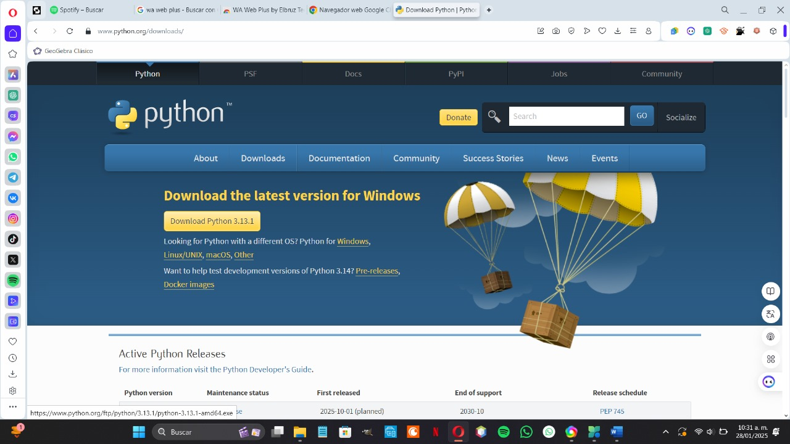
---
#### 3. Esperamos a que se complete la descarga.
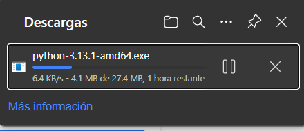
---
###### En caso de que al momento de dar clic en downland, te pide acceso de ruta, solo eliges la ruta adecuada a guardar tu descarga, pero si solo al dar clic y automaticamente se empieza a descargar, solo esperamos. Ejemplo:
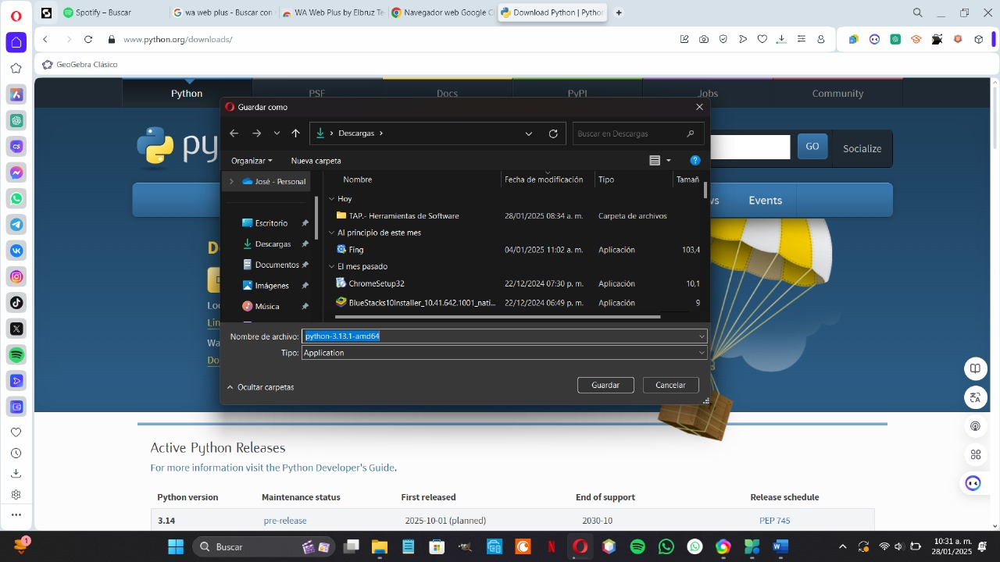
---
#### 4. Al finalizar su descarga, damos continuación en Abrir archivo.
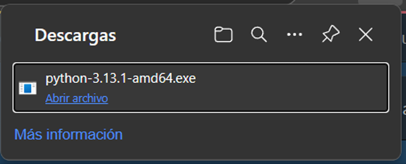
---

### *Paso 2: Instalación de Python*

#### 1. Despues de  dar clic en Abrir archivo, se abre el Explorador de Archivos en descargas, dando doble clic en python para ejecutarlo.
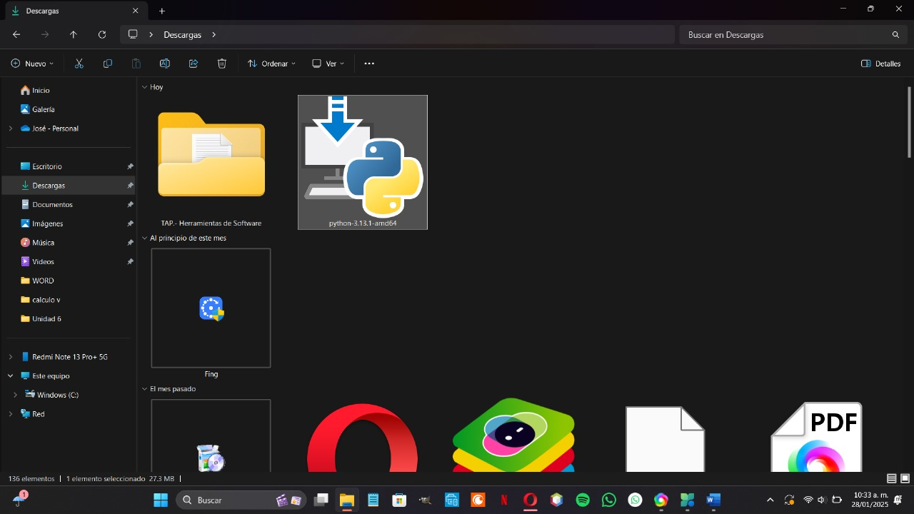
---
* Ventana de inicio: Seleccionamos las dos opciones que se encuentran en la parte de abajo py.exe y phat.
  
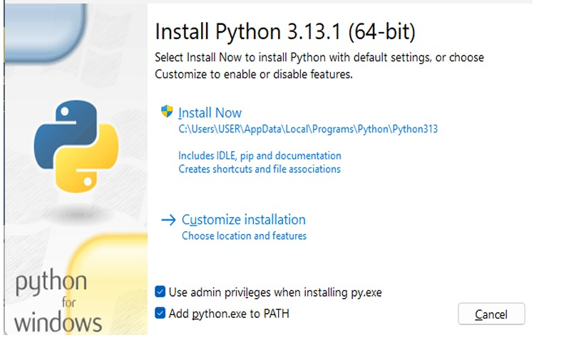
---
* Una vez seleccionado las dos opciones damos clic en Install Now.
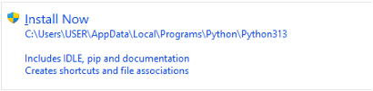
---
* El instalador comenzará a copiar los archivos y configurar Python en tu sistema. Este paso puede tardar unos minutos.
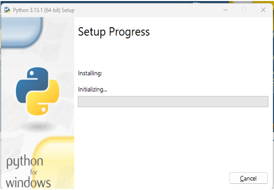
---
* Una vez que se haya copiado los archivos y configurado, hacemos clic en "Close" para cerrar el instalador.
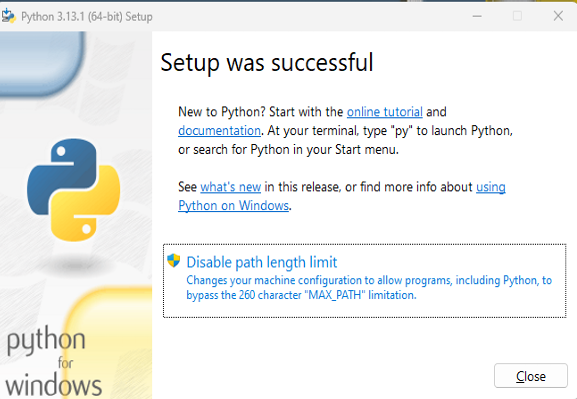
---

### *Paso 3: Configurar Variables de Entorno*

#### 1. Nos dirigimos en la barra de tareas, en buscar y escribimos variables y nos aparecerá lo que es Editar las variables de entorno del sistema.
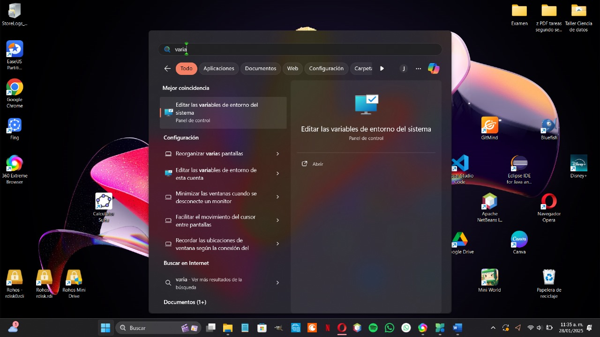
---
* Nos abre una interfaz de Popiedades del Sistema y nos dirigimos en la parte de abajo, dando clic en variables de entorno.
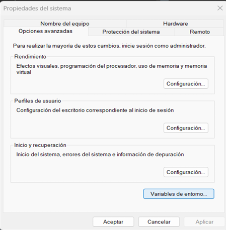
---
* En esta parte, ubicaremos a path, dando así doble clic.
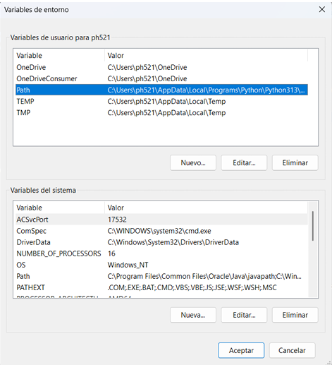
---
* Observando que path si se ubica en Python, y entonces hemos configurado adecuadamente las variables, dando clic en Aceptar.
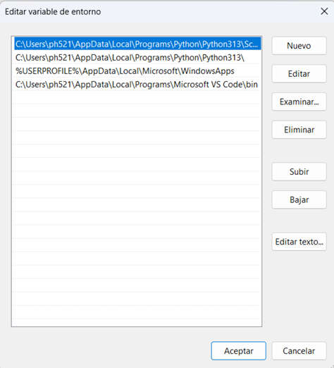
---
* Una vez hecho esto, damos clic en Aceptar, y nuevamente dando clic en Aceptar para cerrar la ventana de Propiedades del Sistema.

---
* Siendo asi, es como hemos finalizado este manual para la descarga e instalación de python...
